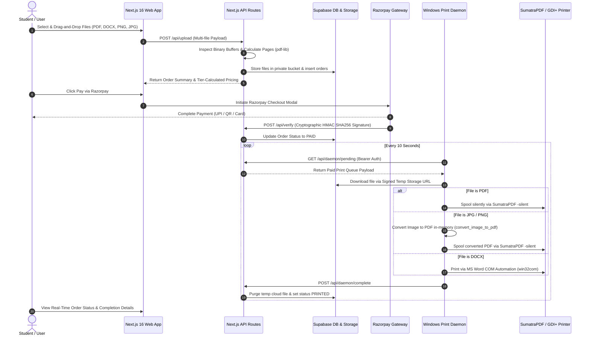

# 𖤓 Printlet — Distributed Campus Micro-SaaS & Hardware Spooler Network

> **An end-to-end, automated campus printing micro-SaaS connecting a Next.js 16 web application with an autonomous background Python print daemon on remote Windows hardware.**

[](https://nextjs.org/)
[](https://www.typescriptlang.org/)
[](https://supabase.com/)
[](https://www.python.org/)
[](https://tailwindcss.com/)

---

## 📌 Technical Overview

**Printlet** is a decoupled full-stack SaaS platform designed to automate physical document printing workflows. Users upload multi-file documents (PDFs, Word files, raster images) via a responsive Next.js 16 web portal, receive dynamic tier-calculated pricing, and complete payment via Razorpay integration. 

Once payment is cryptographically verified, an autonomous background Python print daemon operating on remote Windows hardware fetches the paid print queue via authenticated API endpoints, streams binary documents via signed Supabase Storage URLs, silently spools jobs to physical hardware, and purges cloud and local temporary files upon completion.

---

## 🏗️ System Architecture



---

## ✨ Key System Features

### 🌐 Frontend & API Layer (Next.js 16 + TypeScript)
- **Multi-Format Document Ingestion**: Serverless multi-file payload parsing supporting `.pdf`, `.docx`, `.png`, and `.jpg` formats.
- **Binary Page Counting Engine**: In-memory binary buffer inspection (`pdf-lib`) to extract exact page metrics prior to payment initiation.
- **Dynamic Tiered Pricing Algorithm**: Sub-linear volume pricing tiers (`1-9` pages @ ₹4.00, `10-29` pages @ ₹3.75, `30+` pages @ ₹3.50) with customizable staple fee toggles.
- **Cryptographic Payment Protocol**: Razorpay payment integration with HMAC-SHA256 signature verification to prevent tampering.
- **Role-Based Access Control & RLS**: Service-role API routes (`/api/admin/orders`, `/api/admin/deliver`) using Supabase Service Keys to safely execute administrative mutations while preserving client-side Row-Level Security (RLS).

### ⚙️ Administrative Operations Dashboard
- **Active Queue & Historical Analytics**: Dual-table architecture separating active delivery queues from a 10-day completed order audit log.
- **Staple Indicator Metadata**: Explicit visual indicators (`📌 Stapled`) for hardware operator workflow efficiency.
- **Service Outage Control Toggle**: Real-time maintenance mode switch with fault-tolerant memory fallback state (`lib/site-status-state.ts`).
- **Direct Hardware Test Upload**: Free administrative upload panel to test physical printer spooling without payment gateways.

### 🐍 Autonomous Edge Print Daemon (Python 3.4+)
- **Zero-Touch Spooling**: Runs as an un-monitored daemon process, polling `/api/daemon/pending` using HTTP Bearer authentication.
- **Dynamic SumatraPDF Detection**: Scans system paths and local directories to auto-detect installed or portable SumatraPDF binaries.
- **In-Memory Image PDF Wrapper**: Pure-Python stream builder (`convert_image_to_pdf`) to bypass CLI silent execution limitations for raster images.
- **MS Word COM Automation**: Leverages `win32com.client` (with LibreOffice fallback) to preserve embedded document images and complex layouts.
- **Backward Compatibility Layer**: Custom `Popen` wrappers (`sub_run`) guaranteeing execution across Python 3.4+ and legacy Windows environments.

---

## 🛠️ Engineering Challenges & Technical Solutions

### 1. SumatraPDF Silent CLI Raster Image Limitation
- **Challenge**: Invoking `SumatraPDF.exe -print-to-default -silent image.jpg` resulted in SumatraPDF exiting silently without sending print jobs to the printer queue.
- **Solution**: Engineered a pure-Python in-memory JPEG/PNG to PDF stream converter inside `daemon/print_daemon.py`. Images are converted to PDF objects on-the-fly before passing to SumatraPDF, ensuring 100% silent execution.

### 2. DOCX Embedded Image Rendering
- **Challenge**: Command-line text converters stripped embedded images from `.docx` files during headless printing.
- **Solution**: Implemented MS Word COM automation (`win32com.client.Dispatch("Word.Application")`) to render Word documents with full image and formatting fidelity.

### 3. Legacy Environment & Subprocess Compatibility
- **Challenge**: Target hardware executed Python 3.4.4 on legacy Windows, which lacks `subprocess.run()`.
- **Solution**: Built a custom `sub_run()` compatibility abstraction over `subprocess.Popen()` with standard output piping, making the daemon OS and version agnostic.

### 4. Supabase Client RLS Mutation Constraints
- **Challenge**: Client-side status updates were restricted by Supabase Row-Level Security policies for non-owner updates.
- **Solution**: Created dedicated Next.js server routes using `supabaseAdmin` (Service Role Key) to execute database status transitions securely behind server authentication.

---

## 📁 Project Structure

```
printing-platform/
├── app/
│   ├── admin/               # Admin Dashboard & Operations Panel
│   ├── api/
│   │   ├── admin/           # Administrative Service-Role Routes
│   │   ├── checkout/        # Razorpay Payment Initialization
│   │   ├── daemon/          # Daemon Polling & Completion Routes
│   │   ├── site-status/     # Public Outage Mode Status Route
│   │   ├── upload/          # Multi-File Ingestion & Page Calculator
│   │   └── verify/          # Cryptographic Webhook Verification
│   ├── auth/                # Auth & Registration Pages
│   ├── dashboard/           # Student Print Dashboard
│   ├── privacy/             # Terms & Service Disclosures
│   ├── layout.tsx           # Root Layout
│   └── page.tsx             # Public Landing Page & Calculator
├── daemon/
│   ├── print_daemon.py      # Autonomous Python Print Daemon
│   └── requirements.txt     # Python Dependencies
├── lib/
│   ├── pricing.ts           # Tier-Based Pricing Logic
│   ├── site-status-state.ts # Outage Mode State Handler
│   └── supabase.ts          # Server-Side Supabase Admin Client
├── supabase/
│   ├── schema.sql           # Database Schema Definition
│   └── migration_site_settings.sql # Outage Settings Migration
└── README.md
```

---

## 💻 Local Development Setup

### 1. Environment Setup
Create `.env.local` in the root directory:

```bash
# Supabase
NEXT_PUBLIC_SUPABASE_URL=https://your-supabase-project.supabase.co
NEXT_PUBLIC_SUPABASE_ANON_KEY=your-anon-key
SUPABASE_SERVICE_ROLE_KEY=your-service-role-key

# Razorpay
RAZORPAY_KEY_ID=rzp_test_xxxxxxxx
RAZORPAY_KEY_SECRET=your-razorpay-secret

# Daemon Auth
DAEMON_SECRET_KEY=your-daemon-secret-key
```

### 2. Install & Run Next.js App
```bash
npm install
npx tsc --noEmit
npm run dev
```

### 3. Run Print Daemon
```bash
cd daemon
pip install -r requirements.txt
python print_daemon.py
```

---

## 📜 License

MIT License. Built for full-stack and systems engineering demonstration.
